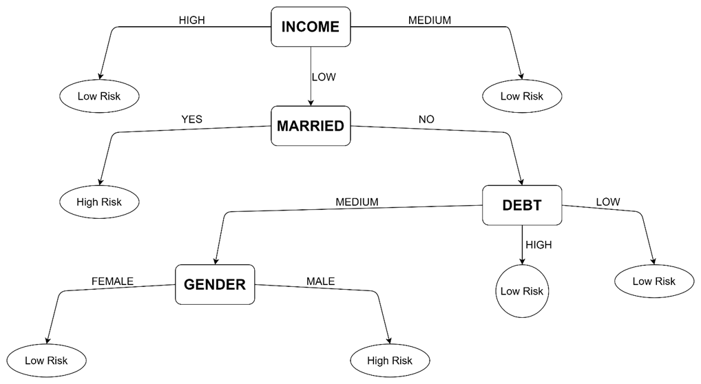
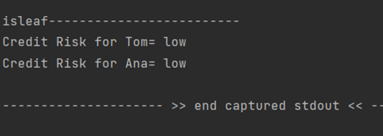
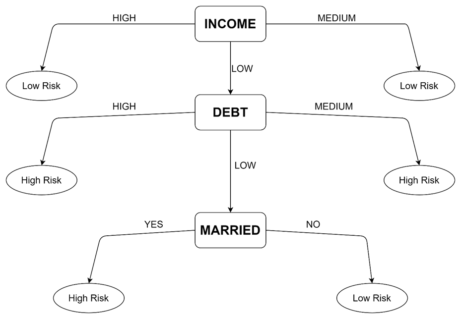

# Decision-Tree---ML
TASK 2-1:
Fig.1 represents the decision tree for Credit Risk Prediction formed using the dataset available in the credit.txt file. 

Here the Rounded Rectangles represents the nodes of the decision tree containing various attributes. The arrows emerging from the nodes represent the values of that attribute (as marked on it.) Ellipse and Circle** represent the leaf nodes containing the corresponding Target Class labels. 

** The given dataset does not provide clarity about the Target Class label for the path Income -> Low -> Married -> No -> Debt -> High. So using the most_common() function, I predicted the Target Class label for this path to be “Low Risk”, represented in a circle in Fig.1. 

Fig. 1

Predicted Credit Risk:

 
	Predicted Credit Risk for TOM is “LOW”
	Predicted Credit Risk for ANA is “LOW”

TASK 2-2:
After changing Sofia’s Credit Risk to “HIGH”, we will receive the following decision tree for Credit Risk Prediction as shown in Fig.2. 

 
Fig.2

	One of the features (attribute) not playing a role in the decision tree constructed from the original dataset is “OWNS PROPERTY” or “Property Ownership.”